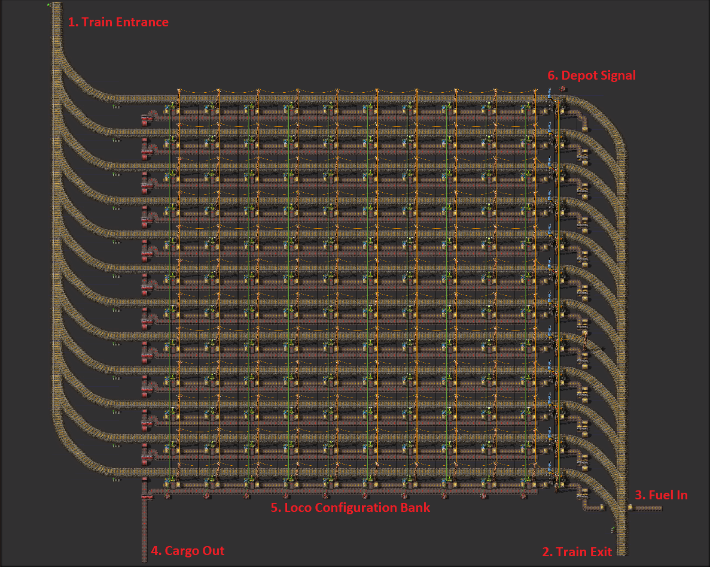
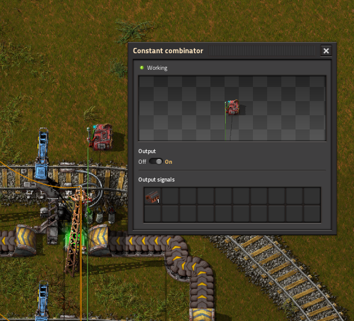
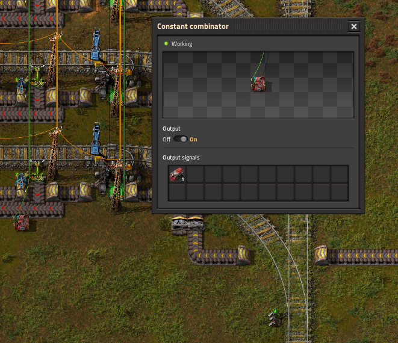
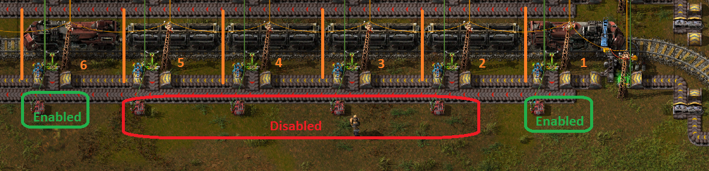
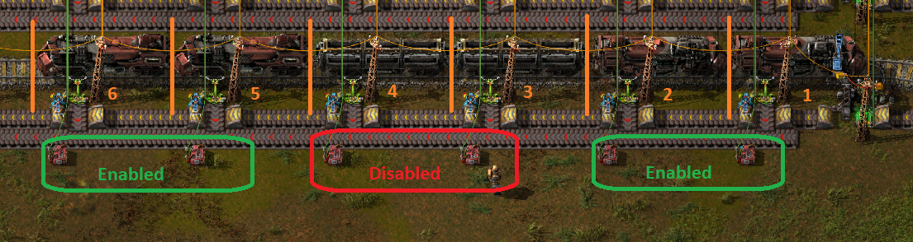

# LTN Compact Depot

A configurable depot blueprint for use with LTN.

### Pre-Reqs
- Knowledge of LTN is assumed
- Do yourself a favor and have filter inserters on your Requester/Provider Stations

### Features
- 12 LTN Depots in a compact form
- Configurable train setups up to length 10 (ex: A 1-4-1 train is length 6)
- Auto refueling of locos
- Auto unloading of remaining cargo
- Auto holds trains at depot while cargo present

### Usage + Options
- Downgrade belts/inserts as needed in the early-ish game (protip: apply an upgrade planner to the BP)
- Typically the **#3 Fuel In** belt is fed by an LTN Requester Station
- The **#4 Cargo Out** belt should feed an LTN Provider Station set to priority. Adjust request/provide limits to your needs.
- Optionally you can add a train stacker in front of the **#1 Train Entrance** but generally a second depot is a better choice.

### Deep Thoughts
- If setup as outlined above, you can have a handy tool to add extra inventory to the train provider network. Say you are at an LTN station and you just cleared a mass of trees. Place them into the spare cargo slots of the train before it leaves. It'll get emptied at the depot and make it's way down to the overflow Provider Station (**#4 Cargo Out** belt) and be available for train requests!
- The **#5 Loco Config Bank** Constant Combinator work as follows. When a locomotive signal is set for a given position, the inserter to load fuel into the loco is enabled. Otherwise the other inserter is enabled to unload cargo.
- There is almost never a need to have the 1st Loco Config Constant Combinator disabled. (More about Loco Configuration elsewhere) The first car in the train is always a Loco. However I wanted some consistency in the layout. If you were switching fuel types, you could disable all Loco Config CC's and it would empty the old fuel. Then re-enable per your train setup to refuel with the new fuel type.

## BP Quick Setup
- Downgrade Belts/Inserters if needed
- Lay down the BP and quickly check several items
    1. All LTN Stations are named *Depot*
    2. The **#6 Depot Signal** is enabled and sending out a Depot Signal. It should look like this:
    
    3. The **#5 Loco Config Bank** Constant CombinatorS are all disabled except for the rightmost unit
    

## Loco Configuration

Now it's time to plug-in you train setup. It's easier that you think! For each position where you'll have a locomotive, enable the loco signal on the corresponding constant combinator. You will enable and disable various items down in the The **#5 Loco Config Bank** Constant Combinators are of the depot. Let's look at some examples.

### 1-2 Train Example

The BP comes configured this way. Positions are 1 .. 10 from Right to Left. Orange lines are just to mark train positions. Constant Combinator in position 1 is enabled (marked in green) and postions 2 .. 10 are disabled (marked in red). This will refuel the locomotive in position 1 and unload any cargo from positions 2 .. 10.

### 1-4-1 Train Example

Constant Combinator in position 1 is enabled (marked in green) and positions 2 .. 5 are disabled (marked in red). Followed by position 6 being enabled (marked in green) as well. This will refuel the locomotive in positions 1 & 6, but will unload any cargo from positions 2 .. 5.

### 2-2-2 Train Example

*yes I understand this is a silly example!* Constant Combinators in positions 1 & 2 are enabled (marked in green) and positions 3 & 4 are disabled (marked in red). Followed by positions 5 & 6 being enabled (marked in green) as well. This will refuel the locomotive in positions 1, 2, 5 & 6, but will unload any cargo from positions 3 & 4.

### To-Do/Future
- Expand to a 12x12 setup (to support 2-8-2 trains) and test.

## Authors

Me. Updates and improvements are welcome. Please submit a PR. I'm sure this can be improved!

## Version History

- v1
    * Initial Release

## License

Free for non-commercial use. 

